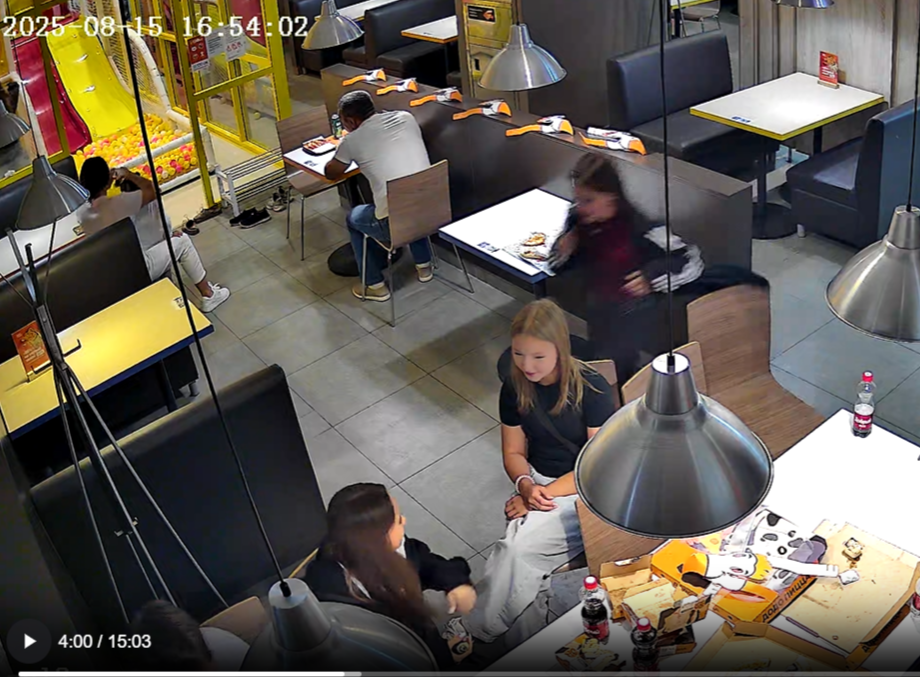

# Table Status Detection Pipeline

Прототип системы детекции занятости столика и сбора аналитики на базе YOLOv8 и OpenCV.

## Технологический стек

- Python 3.8+
- Ultralytics YOLO (детекция персон)
- OpenCV (ввод/вывод, GUI для ROI)
- Pandas (агрегация и расчет метрик)

## Инструкция по запуску

1. Клонирование репозитория и установка окружения:
   ```bash
   git clone https://github.com/gaus-1/DODO-table-detection.git
   cd DODO-table-detection
   python -m venv venv
   # macOS/Linux: source venv/bin/activate
   # Windows: venv\Scripts\activate
   pip install -r requirements.txt
   ```

2. Запуск пайплайна:
   ```bash
   python main.py --video "твоё_видео.mp4" --output "output.mp4"
   ```

3. Запуск Unit-тестов (проверка логики `TableTracker`):
   ```bash
   pytest -v tests/
   ```

4. **Интерактивный этап:** При старте пайплайна откроется первый кадр видео. Выделите целевой стол (ROI) левой кнопкой мыши. Нажмите `ENTER` или `SPACE` для подтверждения.

## Детали реализации

Пайплайн разбит на изолированные компоненты:

- **ObjectDetector** — инкапсулирует YOLOv8n, возвращает координаты bbox класса `person`.
- **TableTracker** — конечный автомат (FSM). Реализует паттерн debouncing (фильтрацию шума): смена состояния столика происходит только при стабильном обнаружении/отсутствии человека в зоне в течение `N` секунд (по умолчанию 2 сек). Это устраняет проблему мерцания при перекрытиях.
- **AnalyticsEngine** — логгер переходов между состояниями (`EMPTY`, `OCCUPIED`). Отвечает за генерацию итогового отчета и расчет среднего downtime.
- **VideoProcessor** — оркестратор I/O, связывает модули и рендерит фреймы.

### Оптимизация производительности (Frame Skipping)
Для обеспечения работы скрипта на слабых машинах (без GPU) алгоритм **не прогоняет** тяжелую нейросеть YOLO на каждом кадре исходного видео (30+ FPS). Вместо этого детекция вызывается только **5 раз в секунду**. В промежуточных кадрах рамка позиционируется по последним известным координатам. Это дает прирост скорости обработки в **5-6 раз**, полностью сохраняя визуальную плавность `output.mp4` и точность работы конечного автомата.

## Итоги тестового прогона

**Обработанное видео:** `видео 1.mp4`
**Выбранный столик:** Свободный столик за спиной мужчины в светлой футболке

**Полученные метрики (Analytics):**
- **Среднее время задержки (Average Downtime):** `5.86 сек.`

*(Скрипт успешно сгенерировал файл `output.mp4` со сменой цветовых индикаторов EMPTY/OCCUPIED в зависимости от состояния FSM автомата).*

### 📸 Пример проблемного кадра


> **Описание проблемы:** На дальнем плане видно, как быстро идущая девушка (с эффектом motion-blur) пересекает зону центрального столика. Наивный алгоритм детекции мгновенно перевел бы столик в состояние `OCCUPIED` (занят). Однако благодаря State Machine и алгоритму Debounce (с задержкой в 2 секунды) система отфильтровывает этот "шум" и не засчитывает мимолетное перекрытие за реальную посадку за стол.

## Результаты работы

- В стандартный вывод (console) попадает прогресс-бар и итоговая таблица (DataFrame) со статистикой: время подхода, ухода и среднее время простоя.
- Результирующий видеофайл `output.mp4` содержит цвето-кодированную визуализацию: зелёный BBox — стол пуст, красный — занят.

## Пути масштабирования алгоритма (Future Work)

В рамках данного прототипа использовался наиболее легковесный подход. Для перевода решения в Production (например, для реальных залов пиццерий) архитектура подготовлена к следующим улучшениям:

1. **Многокамерный трекинг (DeepSORT / ByteTrack):** Переход от покадровой детекции к трекингу. Это позволит не только видеть факт "наличия человека", но и присваивать гостям уникальные ID. Алгоритм перестанет реагировать на проходящих мимо людей или временно перекрывающих стол официантов.
2. **Преобразование перспективы (BEV - Bird's Eye View):** Стандартные 2D Bounding Boxes на видеокамерах часто перекрываются. Использование матрицы гомографии (преобразование плоскости пола в 2D карту) и проверка пересечения нижней точки объекта с маской стола радикально повысит точность (устранит false-positive детекции людей "за" столом).
3. **Асинхронные вебхуки и брокеры (Kafka/RabbitMQ):** Модуль `AnalyticsEngine` изолирован. Метод `log_event` легко переписывается на отправку JSON-событий в очередь сообщений или FastAPI-сервис для дашборда менеджеров смены в реальном времени.
